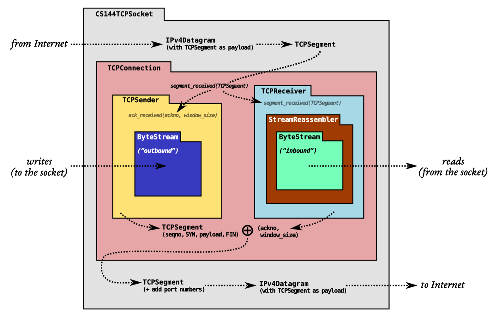
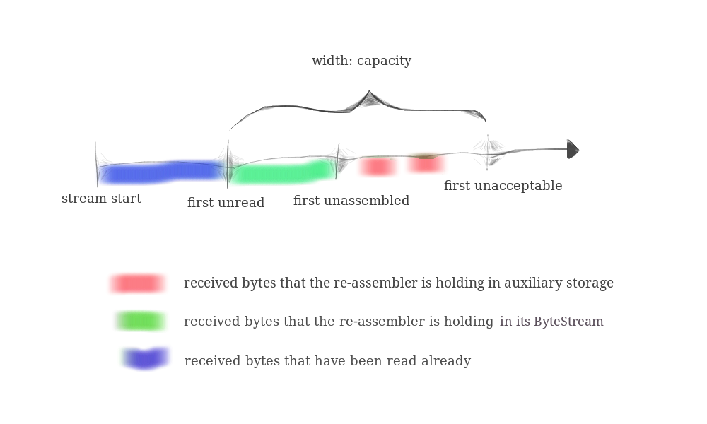

# Lab1

## 环境

```bash
cd build
cmake ..
make format #to normalize the coding style
make #to make sure the code compiles
#make -j2
make check_lab1 #to make sure the automated tests pass
```

## 背景

> 基于TCP协议，使用Internet stream socket从网页获取数据、发送邮件。
>
> TCP协议：实现PC和服务器之间的可靠字节流。
>

| Lab  | 实现工作                      |
| ---- | ----------------------------- |
| Lab0 | makeByteStream                |
| Lab1 | StreamReassembler             |
| Lab2 | TCPReceiver                   |
| Lab3 | TCPSender                     |
| Lab4 | TCPConnection to tie together |



## 实现TCP receiver

接收数据包，并将其转化为可靠字节流。从socket输出，被lab0中webget那样的程序读入。

TCP发送者将字节流分成短的段，网络可能重新排列、丢弃、重复提交这些段。接受者必须重新将它们排列成开始时的样子。

## 类：StreamReassembler

接收：由bytes组成的子串，和每个子串第一个byte在字符流中的索引（索引从0开始）

输出：ByteSteam


**push_substring方法**：

处理溢出capacity



lab0 实现的是 tcp 协议和应用层交互的接口(提供可靠字节流) , 而 lab1 的任务则是将不连续的segment 重组成连续的字节流 , case 很多

## 思路

需要解决的主要问题: 

- out of order
- segment 乱序
- overlapping
- 增量更新

test1: 考虑eof

细节很多，需要不断debug


## code

```c++
//libsponge/stream_reassembler.hh
#ifndef SPONGE_LIBSPONGE_STREAM_REASSEMBLER_HH
#define SPONGE_LIBSPONGE_STREAM_REASSEMBLER_HH
#include "byte_stream.hh"
#include <cstdint>
#include <string>
#include <vector>
#include <map>
#include <algorithm>
class StreamReassembler {
  private:
    ByteStream _output;  //有序字节流
    size_t _capacity;    //字节流容量
    // Your code here -- add private members as necessary.
    size_t _next_index; //需要导入到stream中的下一个字符的index
    size_t _bytes_assembled;  //在 _output 流中的字符数
    size_t _bytes_unassembled;  //在 _unassembled 数组中的字符数
    std::map<size_t,std::pair<std::string,bool>> _tmp_map;  //保存接收到的substring
    // Your code here -- add private members as necessary.
  public:
    StreamReassembler(const size_t capacity);   //构造函数
    void push_substring(const std::string &data, const uint64_t index, const bool eof);    //接收substring,写入到stream中    
    const ByteStream &stream_out() const { return _output; }//输出重组后的有序字节流,不需要编写
    ByteStream &stream_out() { return _output; }
    size_t unassembled_bytes() const;    //已经保存的,但未被组织好的字符个数
    bool empty() const; //返回true，if 没有字符等待被整合
};
#endif  // SPONGE_LIBSPONGE_STREAM_REASSEMBLER_HH
```


```c++
//libsponge/stream_reassembler.cc
#include "stream_reassembler.hh"
template <typename... Targs>
void DUMMY_CODE(Targs &&... /* unused */) {}
using namespace std;
/*
 * 编写四个方法,都在stream_reassembler.hh中有定义
 */
/*
 *构造函数
 */
StreamReassembler::StreamReassembler(const size_t capacity):_output(capacity),_capacity(capacity),_next_index(0),_bytes_assembled(0),_bytes_unassembled(0),_tmp_map() {}
/*
 * 接收substring,写入到stream中
 * 参数eof:表示当前输入data的最后一个字符即为整个字符流的结束
 */
void StreamReassembler::push_substring(const std::string &data, const uint64_t index, const bool eof) {
    size_t min_size = min(data.size(),_output.remaining_capacity());
    if(index == _next_index) { //将所有的字符输出到_output,并从map中删除
        for(size_t i=0; i<min_size; i++) {
            _output.write(data.substr(i,1));
            _next_index++;
            if(_tmp_map.count(index+i)) {
                _tmp_map.erase(index+i);
                _bytes_unassembled--;
            }
        }
        if(eof) {
            _output.end_input();
        }
    }else if(index > _next_index) { //输入的第一个字符位置就大于next_index，需要全部存储到map中
        for(size_t i=0; i<min_size; i++) {
            if(_tmp_map.count(index + i)) {
                continue;
            }
            if(i == min_size-1) {
                _tmp_map[index + i] = pair<std::string, bool>(data.substr(i,1),eof);
            } else {
                _tmp_map[index + i] = pair<std::string, bool>(data.substr(i,1),false);
            }
            _bytes_unassembled++;
        }
    } else {    //index < _next_index
        if(index + data.size() > _next_index){    //若输入的第一个字符已经被纳入，但仍有一部分没有被纳入
            push_substring(data.substr(_next_index - index, data.size()-_next_index+index), _next_index, eof);
        }
    }
    /*
    * 将输入的字符串能输出部分全部输出到stream中后
    * 判断当前在stream中的接下来的字符是否连续
    * 如果连续，需要继续输出到stream中
    */
    while(_tmp_map.count(_next_index)) {   
        pair<std::string, bool> temp_pair = _tmp_map[_next_index];
        _tmp_map.erase(_next_index);
        _bytes_unassembled--;
        if(_output.remaining_capacity() != 0) {
            _output.write(temp_pair.first);
            if(temp_pair.second) {
                _output.end_input();
            }
            _next_index++;
        }
    }
}
//已经保存的,但未被组织好的字符个数
size_t StreamReassembler::unassembled_bytes() const {
     return _bytes_unassembled;
}
//返回true，if 没有字符等待被整合
bool StreamReassembler::empty() const { 
    return _output.buffer_empty();
}
```

