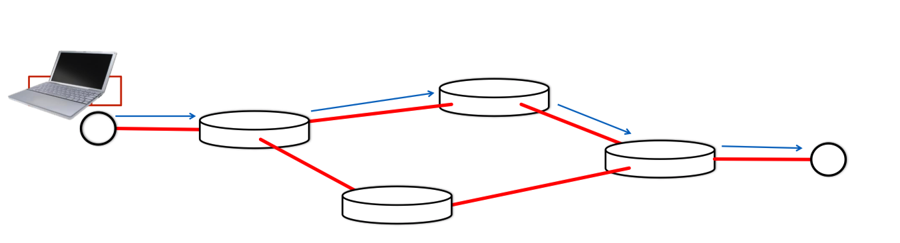
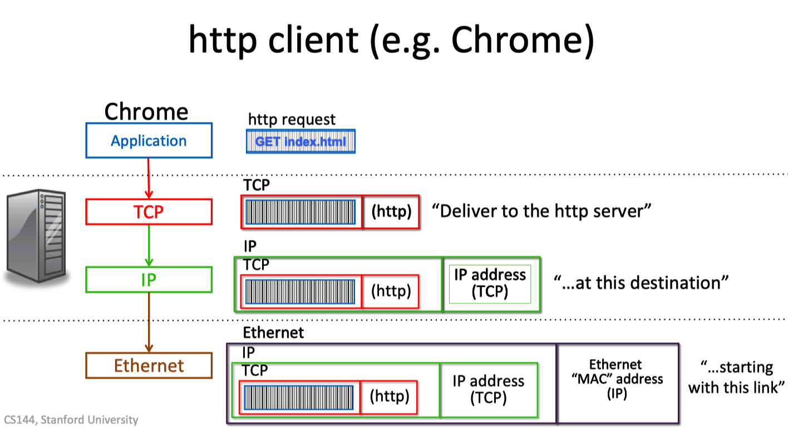

# Stanford_CS144 Introduction to Computer Networking

## ref

[official site](https://cs144.github.io/) and [opensrc in github](https://github.com/CS144)

[Stanford online official site(not open)](https://online.stanford.edu/courses/cs144-introduction-computer-networking)

[2010 fall official site](http://www.scs.stanford.edu/10au-cs144/) with [video in bilibili](https://www.bilibili.com/video/BV1wt41167iN?from=search&seid=18171229994877663002) and [video in YouTube](https://www.youtube.com/watch?v=-nciJGUPyAM&list=PLvFG2xYBrYAQCyz4Wx3NPoYJOFjvU7g2Z)

[lab-documentation](https://cs144.github.io/doc/lab0/index.html)

笔记

[学习笔记](https://andrewmiaoyt.wordpress.com/2019/03/18/stanford-cs144-unit-1-1-5-%E5%AD%A6%E4%B9%A0%E7%AC%94%E8%AE%B0/](https://andrewmiaoyt.wordpress.com/2019/03/18/stanford-cs144-unit-1-1-5-学习笔记/))

### lab参考

- https://carlclone.github.io/2020/06/12/cs144/

- https://github.com/huangrt01/CS-Notes/blob/master/Notes/Output/Computer-Networking-Lab-CS144-Stanford.md


## wk1

### 网络传输不可靠

Applications send and receive data in packets over an Internet that is unreliable:

- packets may arrive out of order, 

- be duplicated, 

- not arrive at all

### IP地址


每个packets携带他终点的IP地址

#### IP数据报的传送路径



```
ping yuba.stanford.edu
traceroute yuba.stanford.edu
tracert yuba.stanford.edu
```


### TCP的作用

确保所有的数据被正确地送到，并按照正确的顺序。

#### how

- 给不同的packet添加序号
- 当一个packet到达时，回复ACK
- 若未收到ACK，再次传送

### HTTP请求



